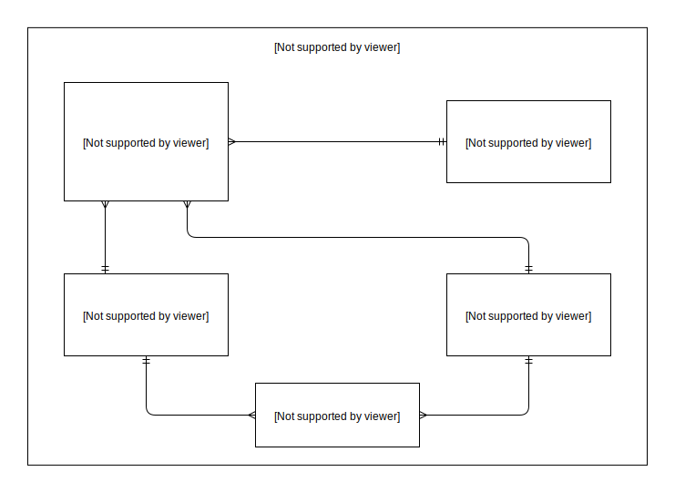

# Airport database

## Project for university subject: Database Design. It consists of creating entity relationship diagram & implementing that design in concrete database, in this case SQL Server.

## Timeline

- ERD entities
- ERD entity relationships
